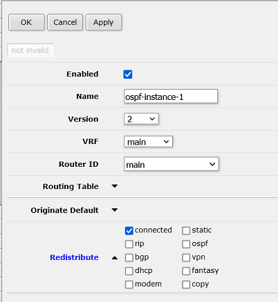
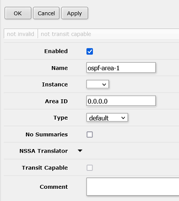
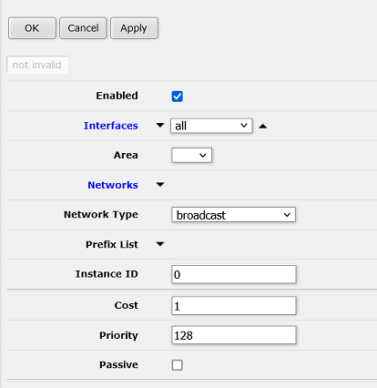

# UUG Routing Lab

* [Part 1 - Booting up](#part-1---booting-up)
* [Part 2 - Connecting to a friend](#part-2---connecting-to-a-neighbor)
* [Part 3 - Routing](#part-3---routing)
* [Part 4 - Building a big network](#part-4---building-a-big-network)

## Background Information

[Networking Overview Slides](index.md)

# Part 1 - Booting up

## Step 0
For this lab, we're building a network with dynamic routing. We have nine
routers, so break yourself into eight teams and take a router. These routers are
small Linux-powered devices [made by MikroTik](https://mikrotik.com/product/RB941-2nD-TC).
For the first few steps, we'll build two separate networks as an `A` and `B` team.

Once you've chosen a router and powered it up, connect to its wireless network.
All of the routers can be managed by browsing HTTP to the loopback IP. The
username and password are both `admin`.

Take a moment to explore the MikroTik web interface (they also have an
SSH interface with a similar structure). Pay particular attention to these pages:

* `Interfaces`
* `IP -> Addresses`
* `IP -> Neighbors`
* `IP -> Routes`
* `Routing -> OSPF`
* `Tools -> Ping`
* `Tools -> Traceroute`

These routers come preconfigured to act much like you'd expect of a home router,
ie one Internet/WAN port, several internal/LAN ports, wireless connected to the
internal side, address translation (NAT) to rewrite internal IP addresses to a
single outside address, and a handful of firewall rules to filter out malicious
traffic. Most of that has been deleted, and replaced with a configuration that
accelerates this lab, and more closely resembles an Internet backbone router.

Each port will need to be configured with its own address and subnet. Ports 1
and 2 have been configured as shown on the router's label sticker. They also have
a DHCP Server configured, that will hand out addresses to anyone who connects to
that port. Ports 3 and 4 have been configured as DHCP clients, so they will try
to request an address from the other end of the cable.

**Important: to keep things simple, make sure to connect Port 1 or 2 to Port 3 or 4.**

# Part 2 - Connecting to a neighbor

## Step 1
Now we're going to build four tiny networks. If you have Router 1, find the
corresponding Router 2, if you have Router 3, find Router 4. As mentioned above,
you want to connect Port 1 to Port 3, as shown here:

Now let's look around RouterOS and make sure it understands what we've done.
Start with the `Interfaces` page, where you should see an `R` next to the
connected port. If you have Router 2 and 4, go to the `IP -> Addresses` page to
confirm that you've received an address from DHCP. Give that address to your
router friend and ask them to ping it. Also try to ping the `192.168.xxx.1`
address.

### Dynamic Address

### Neighbor Discovery

Go to the `IP -> Routes` page and note that you should have a `Connected` route.

## Step 2
At this point, connect Router 2 to Router 3 following the Port 1 to 3 rule, as
shown below. Visit the pages from Step 1 to see the current state of the network.
`Interfaces` should show the correct connections. `IP -> Addresses` should show
an address on all connected ports. `IP -> Routes` should show several `Connected`
routes.

Now let's discover a small problem with our network. Since we only have `Connected`
routes, ping will only work over one hop. You can ping from Router 1 to 2, 2 to 3,
or 3 to 4. However, you can't ping over two hops, such as from Router 1 to 3, or
2 to 4. Try this!

## Step 3 - Complete the loop

Now connect Router 1 and 4 to complete the loop inside both Team A and B. Use the tools from earlier to confirm you have IP addresses and are able to ping across the new link.

# Part 3 - Routing

## Step 4 - Give your router an ID

Routers have to use an IP address to identify themselves to other routers on the network. Because you have multiple IP addresses on your router, it can be confusing which one it chooses, so we're going to set it manually. Navigate to `Routing -> Router ID` and choose `Add New`. Give it a friendly, memorable name and then hit the down arrow to expand the ID box. Type your loopback IP (from the sticker on your router) in the box, then OK to save and close.

## Step 5a - Establish OSPF - Instance

Navigate to `Routing -> OSPF` and choose `Instances`. Select `Add New`, then make sure the `Router ID` is set to the fun name you just created. Expand the `Redistribute` option, and choose `connected`. You need to tell OSPF which links it should advertise to the network, and this will published everything you've connected. Click "OK" to save and close.

## Step 5b - Establish OSPF - Area

OSPF areas allow you to define boundaries around collections of routers. As the number of routers grows, so does the number of links to track and the complexity of calculating best paths. To help your router's tiny CPU, you can subdivide the network and not share routing information when you're crossing well-known links. Using JMU as an example, you could define an east and west-campus area, where the bridge and the tunnel are well-known, high-capacity links. Neither side needs to know the details of every sidewalk on the other side.

Our network is nowhere near the limits being in one "area", so we won't be experimenting with that tonight, but we still have to define one area. Choose the `Areas` tab inside `Routing -> OSPF`. Select `Add New`, make sure the Instance set to the name you chose, leave the rest of the defaults, and hit `OK` to save.

## Step 5c - Establish OSPF - Interface template

The last step to establishing OSPF routing is to define a template of preferences for each link used to connect to other routers. For now, we'll just accept the defaults, but if we have time at the end, this would be a fun place to come back and change interface costs.

Select the `Interface templates` tab under `Routing -> OSPF`. Expand `Interfaces` and choose "all". Select the Area you created. For now, leave the rest of the settings as default and select `OK`.

## Step 6
Our little A and B networks should now be functional. Use the following tools to inspect them:

* `Routing -> OSPF -> Neighbors`
* `Routing -> Nexthops`
* `IP -> Routes`

Routers typically maintain two tables, the "Routing Information Base" (RIB) and "Forwarding Information Base" (FIB). The RIB contains all candidate routes within the network and is more what you'll see in the first two utilities. The FIB are the routes that have been chosen and are being used to forward packets, which is visible in the 3rd page.

Now you can use `Tools -> Ping` and `Tools -> Traceroute` to test connectivity around your network. Try to reach the router in the "opposite corner" that is two hops away. Pay attention to the traceroute to see which link is chosen. Unplug that link and watch the network heal itself.

# Part 4 - Building a big network

## Step 7 - Fiber

Fiber optic connections allow networks to link at higher speeds over longer distances than copper. Some routers allow you to directly use an "SFP" to connect to fiber, while some setups might require an external media converter. For this setup, we have one of each, using relatively short-range lasers (10km), but the better quality single-mode fiber.

For this step, connect the SFP port on Router C to Router A4 Port 2. Router A4 should be a DHCP server, while Router C will be the client.

## Step 8 - Copper

Now back to more traditional connections, connect Router C Port 1 to Router B4 Port 2. Once again, Router C is the DHCP client to Router B4's DHCP server.

## Step 9 - Backup connection

Using what you've learned so far, connect Router A1 Port 2 to Router B1 Port 4. Once you have this working, have Router A2 and B2 ping each other. Use traceroute to see which path the packets use. Unplug the connection between Router A1 and A2, and the connection between Router B1 and B2, and see how the network heals itself.
